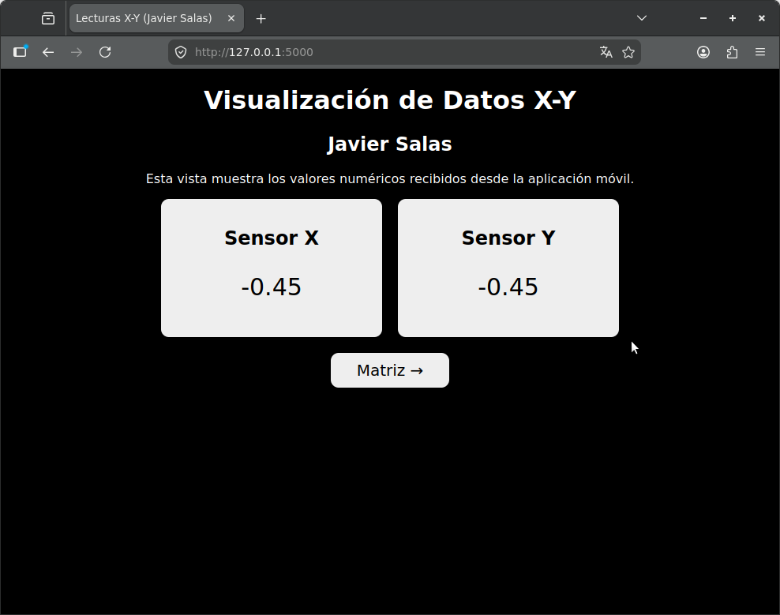
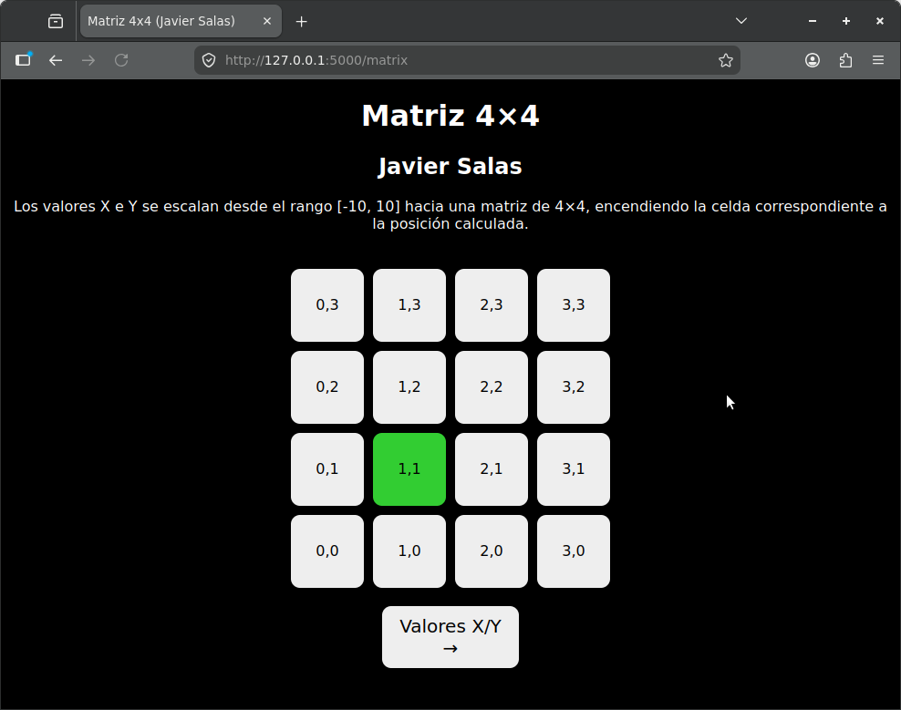

# Visualización de Datos X-Y con Flask

Proyecto desarrollado para la asignatura **Desarrollo de Software para Hardware (DCSH01)**.

La aplicación recibe datos **X** e **Y** desde una aplicación móvil mediante una conexión TCP, utilizando **Flask** como servidor web y una interfaz desarrollada únicamente con **HTML, CSS y Jinja**, sin utilizar JavaScript.

---

## Objetivo

Desarrollar una aplicación web capaz de:

* Recibir datos **X** e **Y** desde una aplicación móvil.
* Mostrar los valores numéricos de ambos ejes en tiempo real.
* Representar gráficamente la posición recibida mediante una matriz de **4×4**.
* Permitir la navegación entre distintas vistas utilizando múltiples páginas HTML.

---

## Funcionamiento

La aplicación se compone de dos vistas principales:

### Página principal

La página principal muestra los valores actuales de los sensores:

* Sensor X
* Sensor Y

La información se actualiza automáticamente mediante la recarga periódica de la página.

---

### Vista de Matriz 4×4

La segunda vista representa los datos X e Y en una matriz de **4×4 celdas**.

Los valores recibidos desde la aplicación móvil tienen un rango aproximado de:

```text
X, Y ∈ [-10, +10]
```

Estos valores son escalados a coordenadas discretas entre **0 y 3**, permitiendo representar la posición dentro de la matriz.

La celda correspondiente a la posición calculada se ilumina en color verde, entregando una representación visual del movimiento o inclinación detectada.

---

## Tecnologías utilizadas

* Python 3
* Flask
* HTML5
* CSS3
* Jinja2
* Sockets TCP

---

## Estructura del proyecto

```text
.
├── app.py
├── README.md
├── templates
│   ├── index.html
│   └── matrix.html
└── capturas
    ├── vista-principal.png
    └── vista-matriz.png
```

---

## Capturas

### Vista principal



---

### Vista de la matriz 4×4



---

## Ejecución

Clonar el repositorio:

```bash
git clone https://github.com/schweineorgel/l401-lecturaxy
cd l401-lecturaxy
```

Ejecutar la aplicación:

```bash
python3 app.py
```

Abrir el navegador:

```text
http://127.0.0.1:5000
```

---

## Referencias

Este proyecto fue desarrollado a partir del repositorio base proporcionado por el docente.
No se utilizaron repositorios adicionales de otros estudiantes.

---

## Autor

**Javier Salas**

Desarrollo de Software para Hardware (DCSH01)
